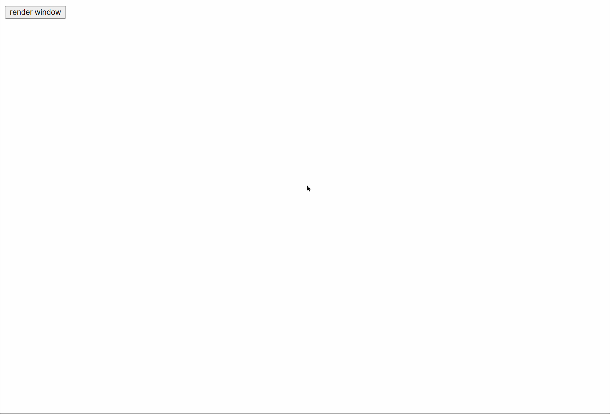

<h1 align="center" style="font-size: 80px;color:#61dafb">📺</h1>
<h1 align="center" style="color: #61dafb;">Wine</h1>

 

浏览器的窗口库 | browser window library

 

[link to doc](http://llixianjie.gitee.io/m78/docs/utils/wine)

 

`Wine` 用于在浏览器端便捷的实现多窗口
`Wine` is used to implement multiple windows conveniently on browser side

## features
* 多窗口       multi-window
* 调整大小      resize
* 拖动         drag
* 自动排列      auto align
* 定制样式      custom style
* 限制拖动     bounded 
* 等...       etc.   
